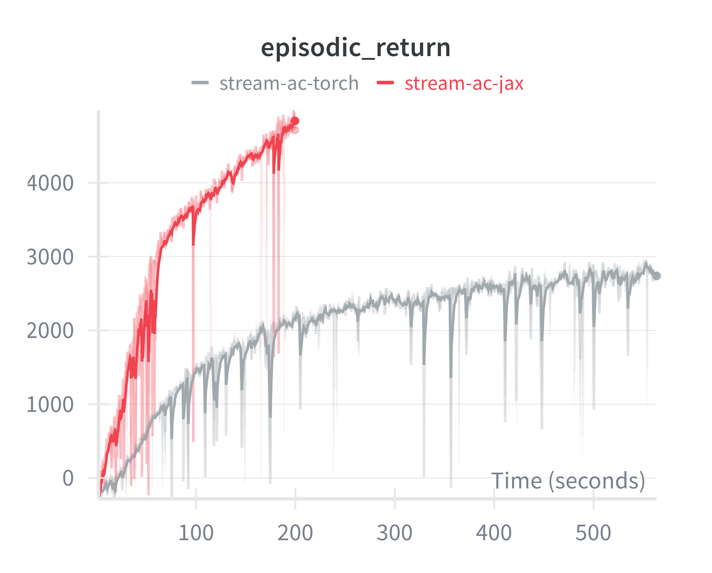

# Streaming Deep Reinforcement Learning

This is the small JAX+Flax reimplementation of <em>[Streaming Deep Reinforcement Learning Finally Works](https://arxiv.org/abs/2410.14606)</em> paper by [Mohamed Elsayed](http://mohmdelsayed.github.io), [Gautham Vasan](https://gauthamvasan.github.io), and [A. Rupam Mahmood](https://armahmood.github.io), which is up to 3-4x faster for small networks (e.g. default two layer 128 hidden dim MLP). Enjoy hacking!

We provide only the implementation of **stream actor-critic for continuous actions**, but other variants from the original repo can be easily adapted in a similar manner.

## Speed comparison

We measured Steps per second (SPS) for each implementation on CPU (AMD Ryzen 5 7500F), GPU (RTX 4070 Ti SUPER) and addtionally on M3 Pro (using default jax backend, so no GPU acceleration). We used default config with HalfCheetah-v5 env. Results below:

| Device | original-torch | jax | speed-up |
|----------|----------|----------|----------|
| CPU   |  ~1060  | ~3700   | ~3.5x |
| GPU   | ~490   | ~1920   | ~3.9x |
| M3 Pro   | ~1870   | ~5220   | ~2.8x |

In streaming regime most of the overhead comes from the pyton and CPU->GPU transfers. For example, naive usage of nnx.jit may reduce SPS to levels comparable to torch, so be mindful. Flax documentation provides good summary here: [Performance considerations](https://flax.readthedocs.io/en/stable/guides/performance.html).

I also tested dm-control envs from [MuJoCo-Playground](https://playground.mujoco.org/), but, as expected, jax-based environments are painfully slow without vectorization across many parallel envs, so there are no benefits in using them (even if end-to-end jitted) in streaming setup.

## Returns

For some reason, with idential hyperparameters Jax version works better in HalfCheetah-v5. Jax and Torch have different default inits, which may be the main reason.

# References

1. [Streaming Deep Reinforcement Learning Finally Works](https://arxiv.org/abs/2410.14606)
2. [Original code-base](https://github.com/mohmdelsayed/streaming-drl)